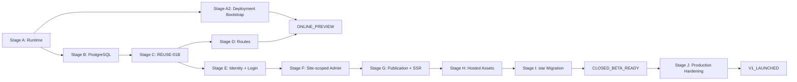

# Self-Hosted V1 Launch Roadmap

> 2026-09-26：`PRODUCT_DELIVERY_MISSION_02` 授权下列 M1–M5 产品研发，
> 无需等待远程 HTTPS 或 Mission 文档合并。远程部署仍冻结；真实数据正式切换、
> 破坏性操作和真实开户资料保持独立审批/输入边界。

> - Status: `CURRENT_SOURCE_OF_TRUTH`
> - Product authority: [PORTFOLIO_PLATFORM_NORTH_STAR.md](PORTFOLIO_PLATFORM_NORTH_STAR.md)
> - Active slice and verified heads: [CURRENT_STATUS.md](CURRENT_STATUS.md)
> - V1 status: `NOT_LAUNCHED`
> - Online status: `NOT_ONLINE_PREVIEW`

M1–M5 determine current product execution. Old Stage numbers below remain a
technical acceptance and eventual deployment mapping. Their per-Stage scope
exclusions limit those historical slices, not Mission-authorized work. No real
server, HTTPS or Docker-repair prerequisite is imposed on local product code.

## 1. Current state

The repository currently has:

- eleven formal, lazy-loaded photography templates;
- Admin V2 with six focused editing sections;
- local photo ingestion and a real local photo library;
- legacy `SiteContent` stored in `site_settings(id = 1)` through D1;
- a frozen `SiteDocumentV1` contract;
- stable Site/Asset ID migration planning;
- a strict legacy adapter;
- a pure Adaptive Composition contract and planner;
- Cloudflare/vinext runtime wiring that is not the accepted self-hosted
  production target.

Standard Next Node parity and repository deployment packaging are accepted.
PR #28 implements PostgreSQL migrations, real Better Auth, operator provisioning,
AuthUser → PortfolioUser → Site and grants, verified against real PostgreSQL in
CI. Local PostgreSQL readback and real star provisioning remain incomplete.
Site routes, independent content, publication and Site assets are the product
delivery path; target Linux deployment is separately unauthorized.

PR #16 remains `KEEP_DRAFT`. It is Auth research evidence for
Better Auth + vinext + workerd + D1, not a self-hosted production baseline.

### Authorized product milestones

| Milestone | User capability and acceptance | Old Stage mapping |
| --- | --- | --- |
| M1 | `/` introduction; existing real `/login`; dynamic `/:siteSlug`; real session/ownership-gated Admin shell; `/test` and `/test/admin` legacy reference; unavailable/unpublished states fail safely; real PG two-user positive/negative HTTP chain | B/C/E foundation reused; D and F entry |
| M2 | Existing basic and premium polaroid editors adapted to Site + independent content-space versions and concurrency; correct editor, no global write shortcut or common mandatory payload | F + G draft foundation |
| M3 | Same-Site Asset pool reused without file copies; independent collections/covers/order; Site-scoped queries and cross-Site denial; removal of reference not deletion; migration dry-run/mapping/recovery | H + I planning |
| M4 | Save Draft only; explicit Publish immutable snapshot/pointer; public page and metadata read same Published version; rollback preserves history; template changes retain other spaces | G |
| M5 | Second anonymous fixture photographer uses operator provisioning and own uploads/editors; grants/session expiry/logout/cross-Site rejection proven; real second account only on user input | E/F/H end-to-end |

Preserve `/preview` and current edits until new content is usable. All product
login/editing belongs to one Standard Next application/origin; test ports do not
become permanent module services. No star hardcode, fake session or global 2601
fallback. M2 adapts SiteContent and PreviewPortfolioDocumentV1 without rewriting
both editors or forcing future templates into one payload.

Each slice records added user capability, existing dependencies, current real
verification, and remaining user/environment/authority needs. Use focused tests;
final milestone/PR head runs full existing gates including real PG and five CI
checks. Do not repeatedly run full research for text-only changes or weaken
budgets/tests/design. Track implementation, CI, local and real-star evidence
independently.

PR #28 remains foundation-only. Topic branches may stack on its verified head;
state real base/dependency, with at most two pending review layers. Delivery or
green CI is not an automatic stop; at capacity, stop dependent work and present
one review list. Merge/approve/auto-merge and remote actions need separate consent.

## 2. Online maturity model

The project uses three distinct production maturity levels:

| Status | Earliest point | Meaning |
| --- | --- | --- |
| `ONLINE_PREVIEW` | Stage A + Stage A2 + Stage D | Public read-only `/` and `/star` are continuously smoke-tested on the real HTTPS server; no Admin, upload, or launch claim is required |
| `CLOSED_BETA_READY` | Stage I | A limited invited client can use login, Site-scoped Admin, Draft/Publish, hosted upload, and the migrated `star` Site; basic operational backups exist |
| `V1_LAUNCHED` | Stage J | Every final launch, security, recovery, image-pipeline, CI, and operations gate is proven |

These statuses are not interchangeable:

```text
ONLINE_PREVIEW != CLOSED_BETA_READY
ONLINE_PREVIEW != V1_LAUNCHED
CLOSED_BETA_READY != V1_LAUNCHED
```

## 3. Dependency graph



Stage A2 is an early launch lane, not a new product-capability Stage. It may
proceed after Stage A while Stages B–D continue. `ONLINE_PREVIEW` is reached
only when both the deployment bootstrap and Stage D public routes are ready.
Online deployment is a separate lane. Continue authorized M1–M5 without waiting
for it; a local Docker failure only blocks local DB/star acceptance. Do not retry
known environment failures without new evidence or install/reset system services.

## 4. Stage A — Runtime migration

### Objective

Establish standard Next.js Node parity without changing product behavior.

### Definition of Done

- standard Next.js replaces vinext as the target production runtime;
- Node production build and start are proven through HTTP integration tests;
- `output: "standalone"` or the reviewed equivalent is available;
- current public page, Admin routes, route handlers, metadata, and redirects
  have parity evidence;
- all eleven templates pass existing and targeted smoke coverage;
- the local photo companion still works in development;
- Cloudflare production bindings and Worker entry are no longer required for
  the Node production artifact;
- CI, build budget, and rendered-route tests understand Next artifacts;
- no production client bundle receives Admin or server-only code;
- rollback to the pre-migration runtime remains documented until cutover.

### Must not do

- add PostgreSQL domain tables;
- integrate production Better Auth;
- redesign `/`, `/star`, or Admin IA;
- rewrite templates, SiteDocument, stable IDs, the legacy adapter, or
  Composition;
- implement hosted upload or deployment.

### Milestone

`STANDARD_NEXT_NODE_PARITY`

## 5. Stage A2 — Deployment bootstrap

### Objective

Establish the minimum real-server deployment path so future Stages validate
against the target Linux environment continuously instead of waiting for final
feature completion.

### Definition of Done

- the production Node artifact from Stage A is packaged;
- a minimal Docker image and Compose shell, or an explicitly approved
  equivalent runtime, starts the application on the target Linux server;
- Caddy is the public reverse proxy and terminates HTTPS;
- a health endpoint and basic application/proxy logs are available;
- a repeatable deploy/update smoke procedure is documented and exercised;
- server-only configuration remains outside client bundles and source control;
- the bootstrap can receive the Stage D read-only routes without exposing
  unfinished Auth, Admin, or upload capabilities.

### Must not do

- implement PostgreSQL domain tables;
- integrate production Better Auth;
- implement hosted assets or processing;
- design the final backup architecture or full monitoring stack;
- migrate production `star` data;
- expose production Admin, upload, or public registration.

### Milestone

`DEPLOYMENT_BOOTSTRAP_READY`

This milestone alone is not `ONLINE_PREVIEW`; Stage D must also complete.

## 6. Stage B — PostgreSQL foundation

### Objective

Create the production database and migration foundation without implementing
product authentication or migrating real `star` data.

### Definition of Done

- Drizzle PostgreSQL driver and bounded connection pool;
- reviewed Portfolio/Auth schema boundaries;
- explicit migration runner with one-runner locking;
- empty database migration and second replay pass;
- upgrade fixture preserving a legacy sentinel;
- native UUID, FK, unique, transaction, and ownership constraints tested;
- ephemeral PostgreSQL in CI;
- backup and restore scripts or test harness prepared for later deployment;
- no request-time DDL or production `push` workflow.

### Must not do

- implement `/login` or production sessions;
- provision real users;
- migrate `star` production data;
- remove or overwrite `site_settings(id = 1)`;
- implement Revision, hosted assets, or deployment in the same PR.

## 7. Stage C — REUSE-01B Better Auth POC

### Objective

Validate Better Auth on the actual target runtime and database before AUTH-01.

### Definition of Done

- Better Auth on standard Next.js Node and PostgreSQL;
- version-pinned runtime, CLI, Drizzle schema, and migrations;
- username + real-email operator provisioning;
- public signup disabled with zero-write evidence;
- no public provisioning endpoint;
- username login, session, logout, and revoke;
- cross-user session isolation;
- Option B AuthUserId → PortfolioUserId mapping;
- ownership allow/deny fixture using real Auth session identity;
- exact-origin regression behind the target proxy model;
- local HTTP and hosted HTTPS cookie behavior;
- partial-provision failure and idempotent repair evidence;
- production Node build and secret-leak scan.

### Must not do

- mount production `/api/auth/*` in the main app;
- add `/login` UI;
- create real `star` production data;
- change public routes or Admin;
- merge Cloudflare-only PR #16 as deployment evidence.

### Decision after completion

Approve or reject Better Auth for production, then decide whether PR #16 is
closed unmerged or reduced to framework-neutral historical research.

## 8. Stage D — Platform and public routes

### Objective

Separate the platform landing page from the first public Site route.

### Definition of Done

- `/` is the Portfolio Platform landing route;
- `/:siteSlug` is the public Site route;
- `/star` resolves through an explicit Site repository seam;
- current `star` content renders without redefining `/` as the portfolio;
- unknown and invalid slugs fail safely;
- server-rendering and metadata route boundaries are established;
- all eleven templates remain available through the Site route;
- no client-provided Site identity is trusted;
- for online acceptance only: `DEPLOYMENT_BOOTSTRAP_READY` has been proven;
- for online acceptance only: the real server serves `/` and `/star` over HTTPS;
- online Production Preview Smoke proves both routes healthy without exposing
  production Admin, hosted upload, or public registration.

### Must not do

- implement production login or account provisioning;
- expose `/star/admin` as an authorized product route;
- implement Draft/Publish persistence;
- migrate real data or implement hosted assets.

### Milestones

`LOCAL_MILESTONE_A`

```text
http://127.0.0.1:3001/
http://127.0.0.1:3001/star
```

`ONLINE_PREVIEW`

```text
https://photo.cosflow.icu/
https://photo.cosflow.icu/star
```

`ONLINE_PREVIEW` is continuously maintained from this point forward. It is not
`CLOSED_BETA_READY` and is not `V1_LAUNCHED`.

## 9. Stage E — Identity and login

### Objective

Introduce the approved production Auth adapter, Portfolio identity, Site, and
operator-provisioned login.

### Definition of Done

- production Better Auth integration based on REUSE-01B evidence;
- `portfolio_users` and `sites` with stable UUIDs;
- `auth_user_id UNIQUE` mapping;
- one User → one Site enforced for V1 without equating IDs;
- operator-only provisioning for real email, username, and initial password;
- `/login`, session, logout, revoke, and disabled public signup;
- exact-origin and proxy-header security;
- shared Site authorization service;
- `star → star = ALLOW` and `alice → star = DENY` at the service/repository
  boundary;
- Production Preview Smoke keeps `/` and `/star` healthy and adds `/login`;
- unfinished `/:siteSlug/admin` behavior remains unexposed until Stage F.

### Must not do

- add public registration, OAuth, MFA, teams, or multiple Sites per User;
- make Better Auth own Site or business authorization;
- implement Admin editing, publication, or assets in the same PR.

## 10. Stage F — Site-scoped Admin

### Objective

Adapt existing basic Admin V2 and the premium polaroid editor behind stable
Site routes, grants and independent content-space boundaries.

### Definition of Done

- `/:siteSlug/admin` selects the authorized editor: basic Admin V2 or premium
  polaroid, retaining existing editing work rather than a generic replacement;
- `/star/admin` requires an authenticated, authorized Site context;
- every read and write repository query is scoped by Site;
- anonymous, wrong-user, mixed-site, and stale-session tests deny access;
- current shared draft, save reconciliation, keyboard shortcut, and responsive
  behavior remain intact;
- current local photo companion remains local-only;
- the old global `/admin` route has an explicit compatibility or retirement
  decision;
- Production Preview Smoke covers `/`, `/star`, `/login`, authorized
  `/star/admin`, and anonymous/wrong-user denial without regressing the public
  routes.

### Must not do

- redesign Admin V2;
- add roles/teams beyond the V1 owner model;
- implement Draft/Publish or hosted uploads early;
- change the eleven templates.

### Milestone

`LOCAL_MILESTONE_B`

```text
http://127.0.0.1:3001/login
http://127.0.0.1:3001/star/admin
```

## 11. Stage G — Draft, Revision, Publish, and SSR

### Objective

Make Save and Publish separate, recoverable operations and serve only Published
content publicly.

### Definition of Done

- drafts and immutable revisions are scoped by Site and content space, with
  independent versions/concurrency; JSONB payload contracts may differ by space;
- Save creates a Draft Revision with optimistic concurrency;
- Publish validates the document, template compatibility, and asset references
  available through the current compatibility resolver; Stage H adds the final
  hosted `ready`-asset gate without changing the Revision contract;
- public rendering reads only `published_revision_id`;
- rollback restores a previous valid revision without rewriting history;
- `/star` HTML, title, description, Open Graph, and Twitter metadata derive
  from the same Published Revision;
- editable `profile.role` is used in future public metadata, city/role empties
  are safe, and `profile.mark` is not the SEO title subject;
- publish invalidates only relevant public cache entries;
- current `SiteDocumentV1` remains frozen;
- Production Preview Smoke proves Save does not change `/star`, Publish does,
  rollback is recoverable, and the existing public/login/Admin routes remain
  healthy.

### Must not do

- store Site identity, URL, or storage path in SiteDocument;
- introduce Composition Variant persistence into V1;
- migrate real `star` data before the target executor is ready;
- implement hosted storage in this stage.

## 12. Stage H — Hosted assets, Sharp, and media

### Objective

Provide authenticated hosted upload and recoverable filesystem assets on the
single-server target.

### Definition of Done

- filesystem AssetStorage rooted outside the app/repository;
- authenticated, Site-scoped streaming upload;
- same-filesystem staging, byte/pixel/quota limits, and abort cleanup;
- production Sharp upgraded to an approved patched version;
- approved Linux format fixtures and explicit HEIC/HEIF policy;
- private original plus thumbnail/card/full variants;
- `uploaded → processing → ready | failed` lifecycle;
- bounded processing with restart recovery and no Redis requirement;
- AssetResolver separates AssetId from storage path and public URL;
- public versioned media, private Admin media, and private original policy;
- filesystem traversal, symlink, MIME spoof, oversized image, and cross-Site
  tests;
- backup and restore of asset metadata plus files;
- Production Preview Smoke covers authenticated upload, generated media,
  Published media, and every previously available public/login/Admin route.

### Must not do

- make R2, S3, MinIO, CDN, or a separate queue service mandatory;
- expose `/var/lib/...`, original filename, or local source path;
- treat the local manifest as the hosted source of truth;
- implement asset deletion unless separately approved.

### Milestone

`HOSTED_UPLOAD_MILESTONE`

## 13. Stage I — star migration

### Objective

Move the current real singleton and local assets into the target identity,
publication, and storage model without losing data.

### Definition of Done

- complete backup of legacy record 1, preview record 2601, manifest, derivatives, and any
  confirmed originals;
- Better Auth User `star` and corresponding Portfolio User;
- stable Site UUID with `siteSlug=star`;
- stable-ID migration reuses the existing pending/completed contract;
- legacy adapter produces a valid SiteDocumentV1;
- assets receive Site-scoped random UUIDs;
- available originals are reprocessed; derivative-only assets are preserved as
  `legacy_derived_only`;
- unresolved migration count is zero before completion;
- Draft, Revision, references, checkpoint, and Published pointer are committed
  with reviewed transactional semantics;
- repeat execution is stable and does not duplicate identities;
- old sources remain read-only through the approved retention window;
- eleven-template and real-content parity is verified;
- a basic operational PostgreSQL and hosted-asset backup exists;
- Production Preview Smoke verifies the migrated `star` login, Admin,
  Draft/Publish, hosted media, and public Published Site without unresolved
  migration items.

### Must not do

- derive SiteId from username/slug;
- derive AssetId from SHA/path/filename;
- mark a blocked migration complete;
- overwrite or delete current real data as part of the first migration pass.

### Milestone

`CLOSED_BETA_READY`

The operator may begin limited invitation testing after this milestone. Final
restore, rollback, monitoring, security, and V1 hardening still belong to
Stage J.

## 14. Stage J — Production hardening and final V1 launch

### Objective

Harden the already-running production preview, close every final operational
and security gate, and promote `CLOSED_BETA_READY` to `V1_LAUNCHED`.

### Definition of Done

- the existing production preview remains continuously available; Stage J is
  not the first deployment;
- the Docker Compose topology for Caddy, App, PostgreSQL, and one-shot
  migration is finalized and reviewed;
- only Caddy publishes 80/443;
- HTTPS and canonical host behavior;
- server-only secret management;
- liveness/readiness and structured logs;
- PostgreSQL daily backup and off-server retention;
- asset backup to an off-server versioned repository;
- clean PostgreSQL + asset restore drill;
- migration rehearsal and previous-image application rollback;
- `/`, `/star`, `/star/admin`, login, Publish, and media canary;
- disk, DB, processing, backup, and 5xx minimum monitoring;
- final security gates and the approved production image pipeline are proven;
- Quality and Public repository safety successful on the release candidate;
- every North Star V1 Launch Gate item is evidenced.

### Must not do

- add Kubernetes, multiple app instances, Redis, object storage, custom domains,
  billing, or blue/green deployment;
- delete persistent volumes as rollback;
- treat prior `ONLINE_PREVIEW` or `CLOSED_BETA_READY` evidence as a substitute
  for final recovery and security evidence;
- declare launch before the restore drill and `star` migration are complete.

### Milestone

`V1_LAUNCHED`

```text
https://photo.cosflow.icu/
https://photo.cosflow.icu/star
https://photo.cosflow.icu/star/admin
```

## 15. Local and online milestone sequence

| Milestone | Available after | Required URLs/capability |
| --- | --- | --- |
| `STANDARD_NEXT_NODE_PARITY` | Stage A | Standard Next Node build/start with current behavior |
| `DEPLOYMENT_BOOTSTRAP_READY` | Stage A2 | Linux packaging, Caddy HTTPS, health, logs, and deploy/update smoke |
| `LOCAL_MILESTONE_A` | Stage D | `/` and `/star` |
| `ONLINE_PREVIEW` | Stage A + Stage A2 + Stage D | Public HTTPS `/` and `/star`, read-only smoke, no launch claim |
| `LOCAL_MILESTONE_B` | Stage F | `/login` and authorized `/star/admin` |
| Publication milestone | Stage G | Draft/Save/Publish/rollback and Published SSR |
| `HOSTED_UPLOAD_MILESTONE` | Stage H | Hosted upload, processing, AssetResolver, media |
| `CLOSED_BETA_READY` | Stage I | Real `star`, complete product loop, hosted media, and basic operational backup |
| `V1_LAUNCHED` | Stage J | Production hardening and every final recovery/security gate complete |

## 16. V1 Launch Gate

The authoritative checklist is in
[PORTFOLIO_PLATFORM_NORTH_STAR.md](PORTFOLIO_PLATFORM_NORTH_STAR.md#17-v1-launch-gate).
Stage J cannot declare completion while any item remains unproven.
Neither `ONLINE_PREVIEW` nor `CLOSED_BETA_READY` is a partial waiver of this
gate.

At minimum, the final evidence bundle must include:

- target runtime and PostgreSQL migrations;
- approved Auth integration and cross-user denial;
- Draft/Publish/SSR behavior;
- eleven-template regression;
- hosted upload and private-original policy;
- zero unresolved `star` migration items;
- HTTPS, health, backup, restore, and rollback;
- Quality and Public repository safety.

## 17. Post-V1 backlog

Post-V1 work is classified by evidence:

| Class | Entry condition |
| --- | --- |
| `P0_PRODUCTION_FIX` | Active security, data-loss, publish, upload, backup, or availability incident |
| `P1_PRODUCT_FEEDBACK` | Real client friction demonstrated after launch |
| `P2_PRODUCT_EXPANSION` | New product capability not needed for V1 closure |
| `P3_INFRASTRUCTURE_SCALE` | Measured capacity or availability need |

Examples of P2/P3 work that must not move onto the V1 critical path include
public registration, recovery UX, analytics, custom domains, more templates,
S3/R2, CDN, Redis, replicas, and external queues.

## 18. COMPOSITION-03 resume points

`COMPOSITION-03` is `NOT_V1_BLOCKER`.

- **Earliest safe research point:** after Stage A. Visual research may use the
  current local Photo Library and pure Composition planner without modifying
  persistence or production templates.
- **Formal integration point:** only after Stage G establishes the publication
  contract and Stage H establishes AssetResolver.

Formal registry, persistence, Admin integration, renderer integration, and any
Vnext document work require separate approval. `SiteDocumentV1` remains frozen.

## 19. Task intake rule

Every new task must record:

```text
Current Stage:
Does it directly advance that Stage Definition of Done?
Does it introduce a V1 non-goal?
Does it cross a later Stage?
Does it change an Architecture Invariant?
Does it affect templates, Admin, SiteDocument, migration, or real assets?
After ONLINE_PREVIEW, does it preserve the existing Production Preview Smoke?
```

Current work must advance M1–M5 without changing Accepted invariants; Stage
questions above describe technical impact rather than a new authorization gate.
Read CURRENT_STATUS for the active slice and checkpoint instead of restarting
Stage A or Auth research. Safe read-only checks, backup and isolated migration
rehearsal are allowed; real import/cutover, overwrites, deletes and system/remote
operations need explicit approval. Missing star credentials block real onboarding,
not anonymous fixture tests. Do not create fake customers in the real account DB.

At a session checkpoint report: new capability; branch/head/PR/dependency;
implemented/CI/local/real-star layers; data and authorization changes; one local
blocker and its impact; safe next work; minimal user action/review. Stop only the
affected work for safety, changed product decisions, missing necessary input,
unauthorized external action, review capacity or exhaustion of safe authorized
work. Subsequent authorized merges do not require a new Mission-resume message.
