# Self-Hosted V1 Launch Roadmap

> - Status: `CURRENT_SOURCE_OF_TRUTH`
> - Product authority: [PORTFOLIO_PLATFORM_NORTH_STAR.md](PORTFOLIO_PLATFORM_NORTH_STAR.md)
> - Current stage: `STAGE_A_RUNTIME`
> - V1 status: `NOT_LAUNCHED`

This roadmap turns the Portfolio Platform North Star into one launch-critical
sequence. Stages are ordered to avoid circular dependencies and to prevent one
PR from combining several infrastructure changes.

## 1. Current state

The repository currently has:

- eleven formal, lazy-loaded photography templates;
- Admin V2 with six focused editing sections;
- local photo ingestion and a real local photo library;
- legacy `SiteContent` stored in `site_settings(id = 1)` through D1;
- a frozen `SiteDocumentV1` contract;
- stable Site/Asset ID migration planning;
- a strict legacy adapter;
- a pure Adaptive Composition contract and planner;
- Cloudflare/vinext runtime wiring that is not the accepted self-hosted
  production target.

It does not yet have a standard Next.js Node production runtime, PostgreSQL,
production authentication, Site-scoped routes, Draft/Publish persistence,
hosted uploads, or the target Linux deployment.

PR #16 remains `KEEP_DRAFT`. It is Auth research evidence for
Better Auth + vinext + workerd + D1, not a self-hosted production baseline.

## 2. Dependency graph

```mermaid
flowchart LR
    A["Stage A: Runtime"] --> B["Stage B: PostgreSQL"]
    B --> C["Stage C: REUSE-01B"]
    C --> D["Stage D: Routes"]
    D --> E["Stage E: Identity + Login"]
    E --> F["Stage F: Site-scoped Admin"]
    F --> G["Stage G: Publication + SSR"]
    G --> H["Stage H: Hosted Assets"]
    H --> I["Stage I: star Migration"]
    I --> J["Stage J: Production Canary"]
```



The launch sequence is intentionally linear. Research may run in parallel only
when it cannot change a later contract or delay the current Stage.

## 3. Stage A — Runtime migration

### Objective

Establish standard Next.js Node parity without changing product behavior.

### Definition of Done

- standard Next.js replaces vinext as the target production runtime;
- Node production build and start are proven through HTTP integration tests;
- `output: "standalone"` or the reviewed equivalent is available;
- current public page, Admin routes, route handlers, metadata, and redirects
  have parity evidence;
- all eleven templates pass existing and targeted smoke coverage;
- the local photo companion still works in development;
- Cloudflare production bindings and Worker entry are no longer required for
  the Node production artifact;
- CI, build budget, and rendered-route tests understand Next artifacts;
- no production client bundle receives Admin or server-only code;
- rollback to the pre-migration runtime remains documented until cutover.

### Must not do

- add PostgreSQL domain tables;
- integrate production Better Auth;
- redesign `/`, `/star`, or Admin IA;
- rewrite templates, SiteDocument, stable IDs, the legacy adapter, or
  Composition;
- implement hosted upload or deployment.

### Milestone

`STANDARD_NEXT_NODE_PARITY`

## 4. Stage B — PostgreSQL foundation

### Objective

Create the production database and migration foundation without implementing
product authentication or migrating real `star` data.

### Definition of Done

- Drizzle PostgreSQL driver and bounded connection pool;
- reviewed Portfolio/Auth schema boundaries;
- explicit migration runner with one-runner locking;
- empty database migration and second replay pass;
- upgrade fixture preserving a legacy sentinel;
- native UUID, FK, unique, transaction, and ownership constraints tested;
- ephemeral PostgreSQL in CI;
- backup and restore scripts or test harness prepared for later deployment;
- no request-time DDL or production `push` workflow.

### Must not do

- implement `/login` or production sessions;
- provision real users;
- migrate `star` production data;
- remove or overwrite `site_settings(id = 1)`;
- implement Revision, hosted assets, or deployment in the same PR.

## 5. Stage C — REUSE-01B Better Auth POC

### Objective

Validate Better Auth on the actual target runtime and database before AUTH-01.

### Definition of Done

- Better Auth on standard Next.js Node and PostgreSQL;
- version-pinned runtime, CLI, Drizzle schema, and migrations;
- username + real-email operator provisioning;
- public signup disabled with zero-write evidence;
- no public provisioning endpoint;
- username login, session, logout, and revoke;
- cross-user session isolation;
- Option B AuthUserId → PortfolioUserId mapping;
- ownership allow/deny fixture using real Auth session identity;
- exact-origin regression behind the target proxy model;
- local HTTP and hosted HTTPS cookie behavior;
- partial-provision failure and idempotent repair evidence;
- production Node build and secret-leak scan.

### Must not do

- mount production `/api/auth/*` in the main app;
- add `/login` UI;
- create real `star` production data;
- change public routes or Admin;
- merge Cloudflare-only PR #16 as deployment evidence.

### Decision after completion

Approve or reject Better Auth for production, then decide whether PR #16 is
closed unmerged or reduced to framework-neutral historical research.

## 6. Stage D — Platform and public routes

### Objective

Separate the platform landing page from the first public Site route.

### Definition of Done

- `/` is the Portfolio Platform landing route;
- `/:siteSlug` is the public Site route;
- `/star` resolves through an explicit Site repository seam;
- current `star` content renders without redefining `/` as the portfolio;
- unknown and invalid slugs fail safely;
- server-rendering and metadata route boundaries are established;
- all eleven templates remain available through the Site route;
- no client-provided Site identity is trusted.

### Must not do

- implement production login or account provisioning;
- expose `/star/admin` as an authorized product route;
- implement Draft/Publish persistence;
- migrate real data or implement hosted assets.

### Milestone

`LOCAL_MILESTONE_A`

```text
http://127.0.0.1:3001/
http://127.0.0.1:3001/star
```

## 7. Stage E — Identity and login

### Objective

Introduce the approved production Auth adapter, Portfolio identity, Site, and
operator-provisioned login.

### Definition of Done

- production Better Auth integration based on REUSE-01B evidence;
- `portfolio_users` and `sites` with stable UUIDs;
- `auth_user_id UNIQUE` mapping;
- one User → one Site enforced for V1 without equating IDs;
- operator-only provisioning for real email, username, and initial password;
- `/login`, session, logout, revoke, and disabled public signup;
- exact-origin and proxy-header security;
- shared Site authorization service;
- `star → star = ALLOW` and `alice → star = DENY` at the service/repository
  boundary.

### Must not do

- add public registration, OAuth, MFA, teams, or multiple Sites per User;
- make Better Auth own Site or business authorization;
- implement Admin editing, publication, or assets in the same PR.

## 8. Stage F — Site-scoped Admin

### Objective

Move the existing Admin V2 behind a stable Site route and ownership boundary.

### Definition of Done

- `/:siteSlug/admin` renders the existing six-section Admin V2;
- `/star/admin` requires an authenticated, authorized Site context;
- every read and write repository query is scoped by Site;
- anonymous, wrong-user, mixed-site, and stale-session tests deny access;
- current shared draft, save reconciliation, keyboard shortcut, and responsive
  behavior remain intact;
- current local photo companion remains local-only;
- the old global `/admin` route has an explicit compatibility or retirement
  decision.

### Must not do

- redesign Admin V2;
- add roles/teams beyond the V1 owner model;
- implement Draft/Publish or hosted uploads early;
- change the eleven templates.

### Milestone

`LOCAL_MILESTONE_B`

```text
http://127.0.0.1:3001/login
http://127.0.0.1:3001/star/admin
```

## 9. Stage G — Draft, Revision, Publish, and SSR

### Objective

Make Save and Publish separate, recoverable operations and serve only Published
content publicly.

### Definition of Done

- `site_drafts` and immutable `site_revisions` use whole-document JSONB;
- Save creates a Draft Revision with optimistic concurrency;
- Publish validates the document, template compatibility, and asset references
  available through the current compatibility resolver; Stage H adds the final
  hosted `ready`-asset gate without changing the Revision contract;
- public rendering reads only `published_revision_id`;
- rollback restores a previous valid revision without rewriting history;
- `/star` HTML, title, description, Open Graph, and Twitter metadata derive
  from the same Published Revision;
- editable `profile.role` is used in future public metadata, city/role empties
  are safe, and `profile.mark` is not the SEO title subject;
- publish invalidates only relevant public cache entries;
- current `SiteDocumentV1` remains frozen.

### Must not do

- store Site identity, URL, or storage path in SiteDocument;
- introduce Composition Variant persistence into V1;
- migrate real `star` data before the target executor is ready;
- implement hosted storage in this stage.

## 10. Stage H — Hosted assets, Sharp, and media

### Objective

Provide authenticated hosted upload and recoverable filesystem assets on the
single-server target.

### Definition of Done

- filesystem AssetStorage rooted outside the app/repository;
- authenticated, Site-scoped streaming upload;
- same-filesystem staging, byte/pixel/quota limits, and abort cleanup;
- production Sharp upgraded to an approved patched version;
- approved Linux format fixtures and explicit HEIC/HEIF policy;
- private original plus thumbnail/card/full variants;
- `uploaded → processing → ready | failed` lifecycle;
- bounded processing with restart recovery and no Redis requirement;
- AssetResolver separates AssetId from storage path and public URL;
- public versioned media, private Admin media, and private original policy;
- filesystem traversal, symlink, MIME spoof, oversized image, and cross-Site
  tests;
- backup and restore of asset metadata plus files.

### Must not do

- make R2, S3, MinIO, CDN, or a separate queue service mandatory;
- expose `/var/lib/...`, original filename, or local source path;
- treat the local manifest as the hosted source of truth;
- implement asset deletion unless separately approved.

### Milestone

`HOSTED_UPLOAD_MILESTONE`

## 11. Stage I — star migration

### Objective

Move the current real singleton and local assets into the target identity,
publication, and storage model without losing data.

### Definition of Done

- complete backup of current `site_settings`, manifest, derivatives, and any
  confirmed originals;
- Better Auth User `star` and corresponding Portfolio User;
- stable Site UUID with `siteSlug=star`;
- stable-ID migration reuses the existing pending/completed contract;
- legacy adapter produces a valid SiteDocumentV1;
- assets receive Site-scoped random UUIDs;
- available originals are reprocessed; derivative-only assets are preserved as
  `legacy_derived_only`;
- unresolved migration count is zero before completion;
- Draft, Revision, references, checkpoint, and Published pointer are committed
  with reviewed transactional semantics;
- repeat execution is stable and does not duplicate identities;
- old sources remain read-only through the approved retention window;
- eleven-template and real-content parity is verified.

### Must not do

- derive SiteId from username/slug;
- derive AssetId from SHA/path/filename;
- mark a blocked migration complete;
- overwrite or delete current real data as part of the first migration pass.

## 12. Stage J — Production Canary

### Objective

Deploy the complete V1 to the user-owned Linux server and prove operations,
recovery, and rollback.

### Definition of Done

- Docker Compose topology for Caddy, App, PostgreSQL, and one-shot migration;
- only Caddy publishes 80/443;
- HTTPS and canonical host behavior;
- server-only secret management;
- liveness/readiness and structured logs;
- PostgreSQL daily backup and off-server retention;
- asset backup to an off-server versioned repository;
- clean PostgreSQL + asset restore drill;
- migration rehearsal and previous-image application rollback;
- `/`, `/star`, `/star/admin`, login, Publish, and media canary;
- disk, DB, processing, backup, and 5xx minimum monitoring;
- Quality and Public repository safety successful on the release candidate;
- every North Star V1 Launch Gate item is evidenced.

### Must not do

- add Kubernetes, multiple app instances, Redis, object storage, custom domains,
  billing, or blue/green deployment;
- delete persistent volumes as rollback;
- declare launch before the restore drill and `star` migration are complete.

### Milestone

`V1_LAUNCHED`

```text
https://photo.cosflow.icu/
https://photo.cosflow.icu/star
https://photo.cosflow.icu/star/admin
```

## 13. Local milestone sequence

| Milestone | Available after | Required URLs/capability |
| --- | --- | --- |
| `STANDARD_NEXT_NODE_PARITY` | Stage A | Standard Next Node build/start with current behavior |
| `LOCAL_MILESTONE_A` | Stage D | `/` and `/star` |
| `LOCAL_MILESTONE_B` | Stage F | `/login` and authorized `/star/admin` |
| Publication milestone | Stage G | Draft/Save/Publish/rollback and Published SSR |
| `HOSTED_UPLOAD_MILESTONE` | Stage H | Hosted upload, processing, AssetResolver, media |
| Migration milestone | Stage I | Real `star` and current assets in target model |
| `V1_LAUNCHED` | Stage J | Production canary and recovery gates complete |

## 14. V1 Launch Gate

The authoritative checklist is in
[PORTFOLIO_PLATFORM_NORTH_STAR.md](PORTFOLIO_PLATFORM_NORTH_STAR.md#17-v1-launch-gate).
Stage J cannot declare completion while any item remains unproven.

At minimum, the final evidence bundle must include:

- target runtime and PostgreSQL migrations;
- approved Auth integration and cross-user denial;
- Draft/Publish/SSR behavior;
- eleven-template regression;
- hosted upload and private-original policy;
- zero unresolved `star` migration items;
- HTTPS, health, backup, restore, and rollback;
- Quality and Public repository safety.

## 15. Post-V1 backlog

Post-V1 work is classified by evidence:

| Class | Entry condition |
| --- | --- |
| `P0_PRODUCTION_FIX` | Active security, data-loss, publish, upload, backup, or availability incident |
| `P1_PRODUCT_FEEDBACK` | Real client friction demonstrated after launch |
| `P2_PRODUCT_EXPANSION` | New product capability not needed for V1 closure |
| `P3_INFRASTRUCTURE_SCALE` | Measured capacity or availability need |

Examples of P2/P3 work that must not move onto the V1 critical path include
public registration, recovery UX, analytics, custom domains, more templates,
S3/R2, CDN, Redis, replicas, and external queues.

## 16. COMPOSITION-03 resume points

`COMPOSITION-03` is `NOT_V1_BLOCKER`.

- **Earliest safe research point:** after Stage A. Visual research may use the
  current local Photo Library and pure Composition planner without modifying
  persistence or production templates.
- **Formal integration point:** only after Stage G establishes the publication
  contract and Stage H establishes AssetResolver.

Formal registry, persistence, Admin integration, renderer integration, and any
Vnext document work require separate approval. `SiteDocumentV1` remains frozen.

## 17. Task intake rule

Every new task must record:

```text
Current Stage:
Does it directly advance that Stage Definition of Done?
Does it introduce a V1 non-goal?
Does it cross a later Stage?
Does it change an Architecture Invariant?
Does it affect templates, Admin, SiteDocument, migration, or real assets?
```

If it does not advance the current Stage, stop with:

```text
OUT_OF_CURRENT_NORTH_STAR
```

The exact next development task is:

```text
STAGE A / RUNTIME-01
Standard Next.js Node Parity
```
